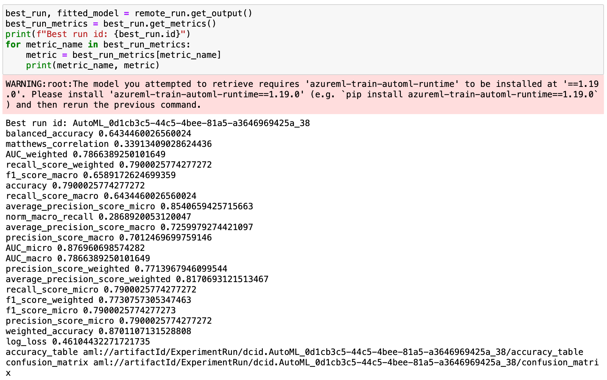
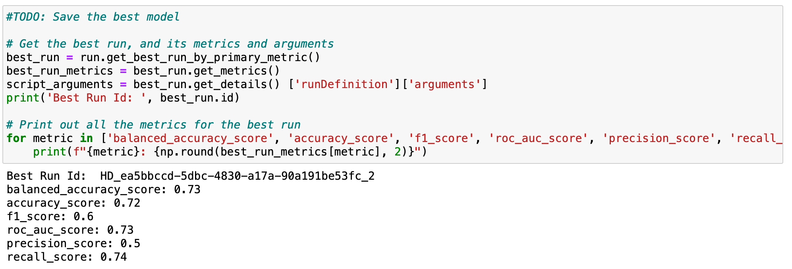

# HR Analytics: Job Change of Data Scientists

This project is used to create two classification models to help predict whether a data scientist will move to a new job.  Both models are trained using [data from kaggle](https://www.kaggle.com/arashnic/hr-analytics-job-change-of-data-scientists). 

The first model is a custom built logistic regression model that includes scikit-learn preprocessing transformers, which is subsequently optimised using `Hyperdrive`.  The second model is an `AutoML` classification solution that includes automatic featurisation to take care of feature selection, impution and scaling for example.

The best resulting model from the two is then registered, deployed and subsequently consumed for demonstration.

  

  

## Dataset

### Overview

The training data is sourced from the **kaggle** [**HR Analytics: Job Change of Data Scientists**
*Predict who will move to a new job*](https://www.kaggle.com/arashnic/hr-analytics-job-change-of-data-scientists) dataset.  It is provided by [Möbius](https://www.kaggle.com/arashnic) under a [CC0: Public Domain](https://creativecommons.org/publicdomain/zero/1.0/) license with [**analyticsvidhya**](https://datahack.analyticsvidhya.com/contest/janatahack-hr-analytics/True/#ProblemStatement) referenced as the source.

It is useful for predicting the probability of a candidate looking for a new job and interpreting affected factors that influence the decision.  The dataset is imbalanced and most features are categorical (Nominal, Ordinal, Binary), some with high cardinality.

The `training` dataset includes 19,158 rows and 14 columns, including the `target` columns and `Employee id`, which are unique employee references.  I have opted to use only the first 1,000 records for expediency.

The `target` column classes include: 

|value|label|
|---|---|
|0|Not looking for job change|
|1|Looking for a job change|
 

### Task

The task is to use the dataset to train binary classification models, one *custom* and the other an *AutoML* model.

I included all features, regardless of `high cardinality`, `low variance` or significant `missing data`, using [Automatic featurization](https://docs.microsoft.com/en-us/azure/machine-learning/how-to-configure-auto-features) to identify and process the issues in the case of `AutoML`, and [RFE](https://scikit-learn.org/stable/modules/feature_selection.html#rfe) for *feature selection* in the custom model.

### Access

I initially downloaded the dataset from kaggle to my local machine and uploaded it the workspace `default blob storage`, registering it as a `dataset` using the SDK.

My models failed to process the data source, so I opted to read the local data into a `pandas dataframe` first before uploading and registering the dataset.  The experiments were able to consume the data, however, it brought about another issue.  `Null` values were uploaded as `NaN`, which Azure datasets did not classify as Null.  I found this [web page](https://docs.microsoft.com/en-us/azure/machine-learning/how-to-train-with-datasets#access-dataset-in-training-script) containing the following advice:

    If your original data source contains NaN, empty strings or blank values, 
    when you use to_pandas_dataframe(), then those values are replaced as a Null value.

This did not solve the problem either, so I changed all `NaN` values with an `empty string`.  The Azure ML dataset correctly validated these as `Null` values.

  

  

## Automated ML

I used the SDK to configure the AutoML solution:
- selecting the newly registered dataset as `training_data`
- using the `target` column as `label_column_name`
- pointing to a newly created `compute cluster` (SKU=STANDARD_DS12_V2) as `compute_target`
- setting the `task` to `classification`
- setting `featurization` to 'auto'
- enabling *early stopping*
- setting the `Primary Metric` to **AUC weighted**, as the classes are unbalanced
- choosing **15** minutes as the `experiment_timeout_minutes`.  This limits the amount of time spent on training
- selecting **5** as the `max_concurrent_iterations`

### Results

The `featurisation` resulted in:
- The input data has been split for validation to improve model performance
- The smaller dataset was classed as `balanced`, even though the larger dataset is not
- Missing feature values were detected and imputed
- High cardinality features were detected and handled
  

The `AutoML` experiment triggered 40 runs of which 3 were cancelled.  The best-resulting model was a `VotingEnsemble` that included the following algorithms and associated weights:

|Algorithm|Weight|
|---|---|
|ExtremeRandomTrees| 0.14285714285714285|
|ExtremeRandomTrees| 0.21428571428571427|
|XGBoostClassifier| 0.21428571428571427|
|LightGBM| 0.14285714285714285|
|ExtremeRandomTrees| 0.07142857142857142|
|ExtremeRandomTrees| 0.07142857142857142|
|RandomForest| 0.14285714285714285|
  

The primary metric used was `AUC Weighted`, which for the best model came in at *0.79*.  The additional metrics achieved were as follow:

|Metric Name|Metric Value|
|---|---|
|balanced_accuracy|0.6434460026560024|
|matthews_correlation| 0.33913409028624436|
|AUC_weighted|0.7866389250101649|
|recall_score_weighted|0.7900025774277272|
|f1_score_macro|0.6589172624699359|
|accuracy|0.7900025774277272|
|recall_score_macro|0.6434460026560024|
|average_precision_score_micro|0.8540659425715663|
|norm_macro_recall|0.2868920053120047|
|average_precision_score_macro|0.7259979274421097|
|precision_score_macro|0.7012469699759146|
|AUC_micro|0.876960698574282|
|AUC_macro|0.7866389250101649|
|precision_score_weighted|0.7713967946099544|
|average_precision_score_weighted|0.8170693121513467|
|recall_score_micro|0.7900025774277272|
|f1_score_weighted|0.7730757305347463|
|f1_score_micro|0.7900025774277273|
|precision_score_micro|0.7900025774277272|
|weighted_accuracy|0.8701107131528808|
|log_loss|0.46104432271721735|
  

The algorithm is impressive as it delivers both good recall and precision, which is summarised by both variants of the `F1 score`.
  

*TODO* Remeber to provide screenshots of the `RunDetails` widget as well as a screenshot of the best model trained with it's parameters.
 

**AutoML RunDetails**

The next screenshot is the AutoML RunDetails widget output, showing the experiment as *Completed*, listing all child runs in order of best metric performance.  It includes a visualisation of the performance as a dotplot, with a `cummax` line showing the maximum (best) metric achieved for all child runs.

**AutoML Best Run**

The screenshot below provides an output of the best model from the `AutoML` experiment, showing the associated metrics of model performance.

  

  

## Hyperparameter Tuning

I created an [sklearn pipeline](https://scikit-learn.org/stable/modules/compose.html#pipeline) to clean the data first before training a model.  I `imputed` missing values, `encoded` the categorical features and `scaled` the numerical values.  I then used `RFE` with an `SVM` model to select the best features.

**Comparing algorithm performance**

Following this I compared the performance of a variety of models, using the `F1 score` to obtain a good balance between `precision` and `recall`, with the emphasis on the latter metric.  The results are as follow:

I chose the [Logistic Regression](https://scikit-learn.org/stable/modules/generated/sklearn.linear_model.LogisticRegression.html) model as it provided the best overall performance without any hyperparameter optimisation. The `Naive Bayes` model performed very well on `recall`, with the downside of having the worst `precision` score overall.

I submitted an experiment with the updated training script to AzureML, using the `Hyperdrive` function to iterate through a subset of parameter combinations.

The parameter search space and ranges/ choices used to optimise the model included:

|Pipeline Element|Argument|Description|Value|
|---|---|---|---|
|Logistic Regression|C|Inverse of regularization strength; must be a positive float. Like in support vector machines, smaller values specify stronger regularization.|uniform(0.001, 1)|
|Logistic Regression|Maximum Iterations|Maximum number of iterations taken for the solvers to converge.|choice(range(35,150))|
|[RFE](https://scikit-learn.org/stable/modules/generated/sklearn.feature_selection.RFE.html)| Minimum Features|The number of features to select. If None, half of the features are selected. If integer, the parameter is the absolute number of features to select. If float between 0 and 1, it is the fraction of features to select.|choice(range(5,20))|
  

### Results

The randomised search significantly improved upon the initial spot check, boosting `recall` and `F1 score` to 0.74 and 0.6 respectively with only a few cycles.  **Impressive.**

The best run, with a `recall score` (primary metric) of 0.744 was based on the following hyperparameters:

|Pipeline Element|Argument|Value|
|---|---|---|
|Logistic Regression|C|0.6350352169569567|
|Logistic Regression|Maximum Iterations (max_iter)|65|
|RFE| Minimum Features (min_features)|5|

I could have improved performance by spending more time on `feature engineering` and including additional `transformations` (like [power transform](https://scikit-learn.org/stable/modules/generated/sklearn.preprocessing.PowerTransformer.html#sklearn.preprocessing.PowerTransformer) to change distributions for example).  However, this is very time-consuming and requires domain knowledge in many cases to be effective.

**Hyperdrive RunDetails widget**

The following screenshot shows the output from the RunDetails widget, once the submitted experiment completed.

**Hyperdrive best model detail**

The following screenshot shows code that is used to extract the best model by using the `get_best_by_primary_metric` method of the `Run` class, and then using the `get_metrics` to return all logged metrics.

**Hyperdrive best model and other child run performance and parameters**

The next screenshot demonstrates the `Run` class `get_children_sorted_by_primary_metric` method which returns all child runs in performance order.  It provides a list of the hyperparameters for each run, including the best run at the top of the list.

  

  

## Model Deployment

The best model resulting from the `AutoML` experiment significantly outperformed the results achieved by the `Hyperdrive` experiment.  

I used the SDK to deploy the model by the following steps:
- call the `get_output` method on the `run` object, with one of the outputs resulting in the `best_run` object.
- extract the model name from the `best_run` properties and used it as input to the `register_model` of the `run` object to register the best-resulting model
- use the `download_file` method of the `best_run` object to download the environment `.yml` file and scoring python script
- instantiate the `InferenceConfig` using the downloaded environment file and scoring script
- create a deployment configuration using the `AciWebservice` class
- deploy the model, using as input the:
    - registered model object
    - instantiated `InferenceConfig`
    - instantiated ACI config

I consumed the endpoint once the model was successfully deployed.  To query the endpoint, use the SDK to:

- extract and save the `endpoint URI` from the `workspace webservices` dictionary, or navigate to `Endpoints` section on the relevant Azure ML Studio workspace and copying the `endpoint URI` from the properties
- read in one line of sample data from the test data to create an appropriate JSON body payload
- define the header as an `application/json` content type
- submit a post request to the `endpoint URI`, using the previously created header and input data
- print out the `.json` response
  

**Active AutoML Endpoint**

The screenshot shows the registered model's deployed endpoint with a `Deployment state` of `Healthy`.

  

  

## Screen Recording

https://youtu.be/MmDjKK7qXjY
